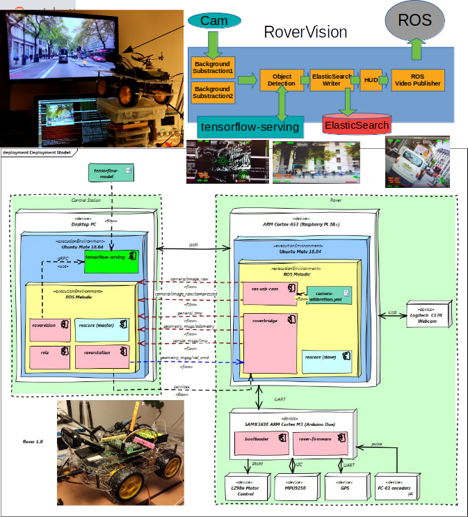

Introduction
============

This is a library to explore algorithms that extract information from video with focus on fast prototyping.
It is organized as a collection of ready-to-use components and a paradigm to integrate them into fully-fledged 
services.

But before entering into the library details, let's try to define what is the motivation behind analyzing video.

Motivation
----------

This library starts both as an academic project an as the evolution of a codebase to study algorithms 
for computer vision in a  `ROS package for vision in a rover <https://github.com/nhorro/rovervision>`__

Even if there exists OpenCV an other frameworks, the focus of this approach is to be able to quickly 
connect existing components with custom ones to propotype ideas or study algorithms in a similar way
as this is performed in `Keras <https://keras.io/>`__ an `scikit-learn <https://scikit-learn.org/>`__.

Some of the code present in this library was used during experimentation with object detection, motion 
estimation, and generation or publication of data to made it available in other systems such as DBs. 
For example :numref:`fig-rover-arq`. illustrates how the rovervision pacakage was integrated 
in the SW ecosystem for a remote controlled rover.

.. _fig-rover-arq:

    rovervision in the rover SW system architecture.

What is video analytics?
------------------------

Video content analysis is the capability of automatically analyzing video to detect and determine 
temporal and spatial events. As showed in the rover example, it can be an initial stage for a more complex
process such as navigating a scene for executing a mission.

The extraction of meaningful information from a sequence of frames involves several techniques from 
computer vision. The following list describes some of the tasks performed in videoanalytics. 

- Dynamic masking: blocking a part of the video signal based on the signal itself, for example because 
  of privacy concerns.
- Motion detection: motion detection is used to determine the presence of relevant motion in the observed 
  scene.
- Object detection: object detection is used to determine the presence of a type of object or entity, 
  for example a person or car. Other examples include fire and smoke detection.
- Recognition: face recognition and automatic number plate recognition are used to recognize, and 
  therefore possibly identify, persons or cars.
- Tamper detection: tamper detection is used to determine whether the camera or output signal is 
  tampered with.
- Video tracking: Video tracking is used to determine the location of persons or objects in the video 
  signal, possibly with regard to an external reference grid.
- Object counting and event triggering: activating alarms or registering events when an object enter 
  or leaves a region of the video signal.

This library provides components for each specific task and proposes a simple way to to implement 
combinations of them. 