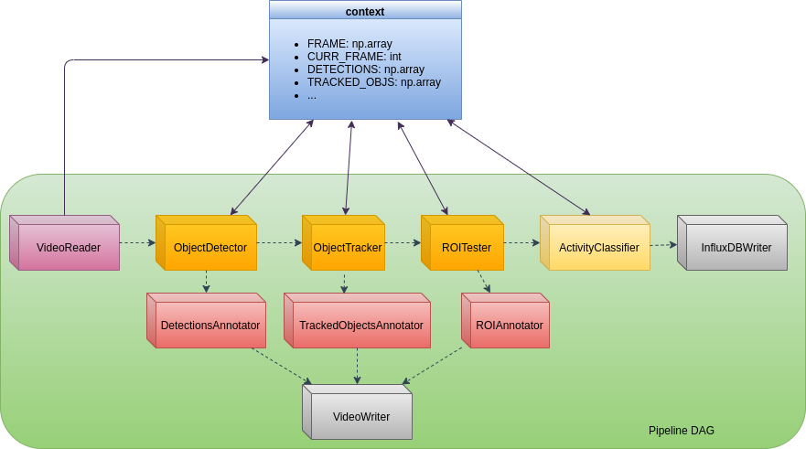
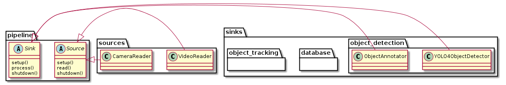

The pipeline paradigm
=====================

The pipeline module contains the building blocks for implementing the pipeline paradigm.
This implementation defines two concepts:

    - **Sources**: components that acquire data from a device such as a camera or file.
    - **Sinks**: components that process previously generated data. Their output can be additional information  available to other component or an action, as publishing data to a DB or communication middleware.

Pipelines are chained components that perform succesive steps in order to obtain a final product. 
Each pipeline is composed of **only one source** of information and one or more **sinks** that 
perform operations.

Pipelines are not restricted to video frames, but to keep things simple we will be assuming that 
each unit of information is a video frame.

:numref:`fig-pipeline` shows the executed model for an example pipeline that tracks objects and 
performs some kind of activity classification based on their trajectories.    

.. _fig-pipeline:

    Example of a pipeline. Dashed arrows indicate dependencies and solid arrows indicate read 
    and write access to the shared context.

Notice that the pipeline is defined as a `directed acyclic graph <https://en.wikipedia.org/wiki/Directed_acyclic_graph/>`_ but it is executed in a 
sequential order one component at a time. The sequence to grant that dependencies are met is obtained using the 
`topological sorting <https://en.wikipedia.org/wiki/Topological_sorting/>`_ algorithm.

Another aspect to consider is that there is no direct communication between components, as data is shared
through a *global context* that is passed by reference to each component during initialization.

This decision is inspired in the `blackboard design pattern <https://en.wikipedia.org/wiki/Blackboard_(design_pattern)/>`_
as it reduces the complexity of defining specific interfaces. Also, all data is shared in standard python
and scipy data types such as dictionaries and numpy arrays. 
Each component declares in its API which variables it needs and which variables it creates and/or updates.
Note that while this might be convenient for prototyping, it might not be an optimal solution for 
a production pipeline.

Together with model performance evaluation, processing time and CPU and resource consumption are
relevant for the selection of a suitable algorithm.

The execution of a pipeline automatically measures the initial and end time for each iteration and stores
some statistics such as best and worst cases, and average processing time. Callbacks are provided for
more specific metrics such as memory consumption, that heavily depend on the underlying implementation of
each component.

Component organisation
----------------------

The library proposes the division of components in the aforementioned categories: sources and sinks.
These categories can then be furtherly grouped in components for more specific tasks or domains:

  - Background substraction an motion estimation.
  - Object detection.
  - Object tracking.
  - Visualization/anotation.
  - Domain/application-specific.

Thus, the different components inherit the core Source and Sink abstract classes in the pipeline
module and are mantained in children modules as indicated in :numref:`fig-package`.

.. _fig-package:

    Example of module organisation

API reference
-------------  

.. automodule:: videoanalytics.pipeline
   :members: